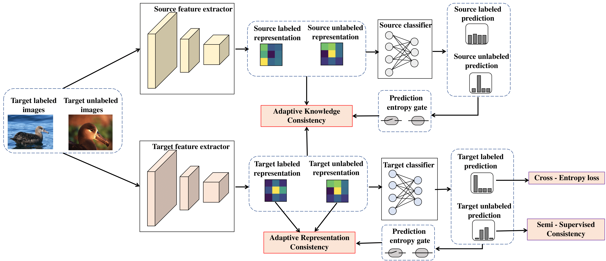
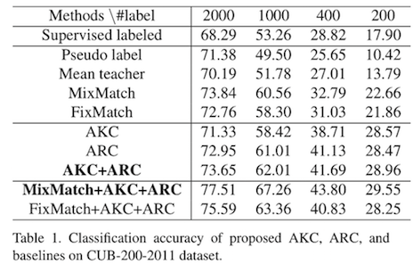
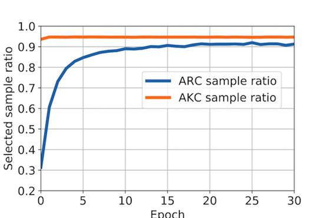
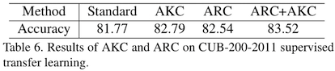
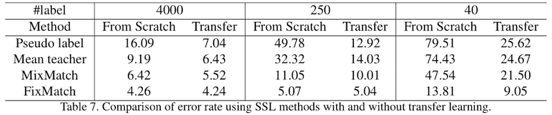

# Adaptive Consistency Regularization for Semi-Supervised Transfer Learning

## Contents
1. [Introduction](#Introduction)
2. [Tasks](#Tasks)
3. [Citation](#citation)

## Introduction

在这项工作中，我们考虑半监督学习和转移学习联合，导致更实用和竞争的范例，可以利用强大的预训练模型从源域，以及标记/未标记的数据在目标域。为了更好地利用预先训练的权重和未标记的目标示例的价值，我们引入了自适应一致性正则化，该正则化由两个互补组件组成：源和目标模型之间（标记和未标记）示例上的自适应知识一致性（AKC）和自适应表示一致性（ARC）关于标记和未标记示例之间的目标模型。一致性正则化中涉及的示例根据它们对目标任务的潜在贡献（通过预测熵测量）自适应地选择。此外，我们的算法与现有方法正交，因此能够在现有半监督学习方法的基础上获得额外的改进。

## Tasks
### Semi-supervised transfer learning 
AKC和ARC正则化项可以与其他半监督学习方法相结合，

比如混合匹配和固定匹配。通过在混合匹配中使用AKC和圆弧正则化技术，性能显著提高。

CUB-200-2011数据集的结果：

ARC和AKC中的实际样本选择比率如CUB-200-2011数据集实验图2所示。

可以看出，ARC的样本选择比率正在逐渐增加。这可以看作是一种课程学习。  

### Supervised transfer learning 
AKC和ARC都提高了标准迁移学习的性能。

### Effectiveness of transfer learning in semi-supervised setting
在以前的研究中，人们低估了半监督环境下迁移学习的有效性。

有了印记技术和适当的训练策略，迁移学习可以带来显著的改善，特别是当标记的例子不足时。

在CIFAR-10上使用和不使用转移学习的SSL方法的结果：
  

