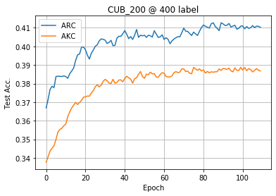

# 半监督迁移学习的自适应一致性正则化


## About the code
The code is developed on CentOS 6.3 environment (Python 3.6, PyTorch 1.1, CUDA 9.0) with Tesla V100 GPUs.   
Please check the core training part of the code in [train.py](ssl_lib/trainer/train.py); check the implementation of ARC and AKC in [regularizer.py](ssl_lib/consistency/regularizer.py).  
For the hyperparameter in [parser.py](parser.py),  `lambda_kd` represents the regularization weight factors for AKC, and `lambda_mmd` represents the regularization weight factors for ARC;
`kd_threshold` and `mmd_threshold` are the threshold value for AKC and ARC;
`mmd_feat_table_l` and `mmd_feat_table_u` represent the ARC buffer size for the labeled data and for the unlabeled data.

## How to run the code

### Run on CUB-200-2011

1) Download the [CUB-200-2011 dataset](http://www.vision.caltech.edu/visipedia/CUB-200-2011.html) in your data folder, e.g. `./data/`.
2) Pretrain the ResNet-50 model on [Imagenet](http://image-net.org/download-images) or download the Imagenet pretrained models from [pytorch.models](https://download.pytorch.org/models/resnet50-19c8e357.pth) in your checkpoint folder, e.g. `./ckpt/`. Then rename the pretrained checkpoint as `resnet_50_1.pth`.  
PS: The output of our model is slightly different from the original ResNet-50 model, please check the code.
3) In [parser.py](parser.py), `lambda_kd` represents the regularization weight factors for AKC, and  `lambda_mmd` represents the regularization weight factors for ARC.   
4) run [main.py](main.py) on CUB-200-2011 dataset.  
 
e.g: Train the models with ARC:
```
pretrain_path="ckpt" # pretrained model path
data_root="data" # data folder
dataset=cub200
num_labels=400
arc=50 # adaptive representation consistency (semi-supervised)
akc=0 # adaptive knowledge consistency (transfer)
CUDA_VISIBLE_DEVICES=0,1 python -u main.py \
--data_root $data_root --dataset $dataset --num_labels $num_labels --pretrained_weight_path $pretrain_path  \
--lambda_mmd $arc --lambda_kd $akc 
```

The default MixMatch parameters are:   
`--coef 500 --alpha 0.75 --alg ict --consistency ms --warmup_iter 4000 --ema_teacher true --ema_teacher_train true --ema_teacher_warmup true --ema_teacher_factor 0.999`

The default FixMatch parameters are:   
`--coef 0.5 --alg pl --strong_aug true --threshold 0.95  --ema_teacher true --ema_apply_wd true --ema_teacher_factor 0.999 --cutout_size 0.5`

4) (Optional) Plot the training and evaluation results as [plot_loss.ipynb](plot_loss.ipynb).
e.g: Evaluation accuracy during an experiment on CUB_200_2011 dataset with 400 labeled examples as shown below.  
    

